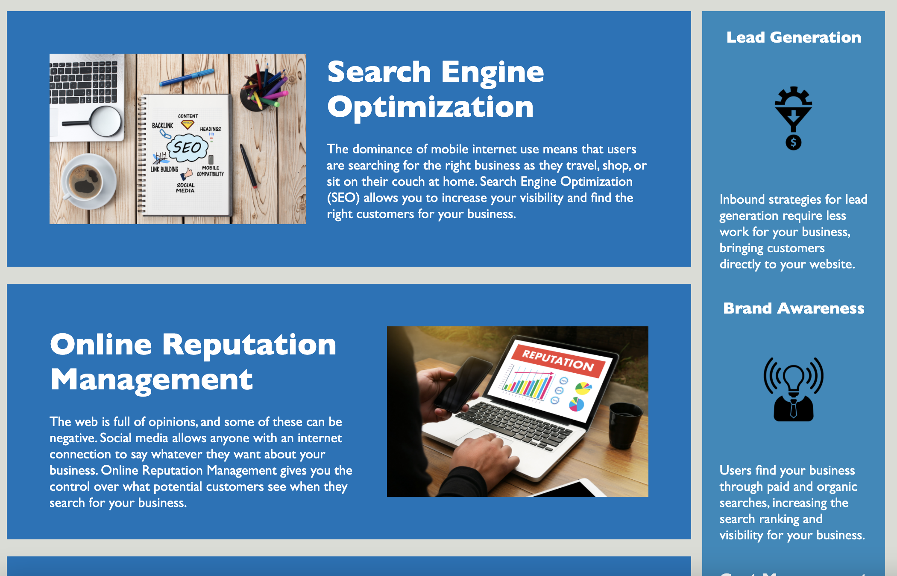
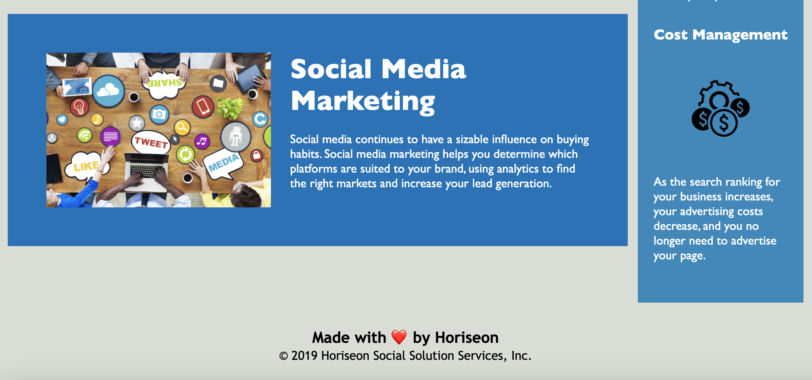

# Horiseon-Accessibility-Website
Horiseon Website Optimized with Semantic HTML Elements

## Description

In order to improve the Horiseon Website to meet accesibilty standards and optimize search engine function, the following steps have been taken:

* "Alt" attributes have been added to all images.
* Comments have been added to describe the various sections.
* Semantic HTML elements have been used to replace non-semantic div tags.
* CSS classes with identical formatting have been consolidated.

## Usage

This website is intended to be used as a demonstration of semantic HTML elements and consolidated CSS code. The following screenshots show that the deployed website matches the assignment directions.

Deployed link can be found at: [GitHub](https://suejinkim20.github.io/Horiseon-Accessibility-Website/)

## Credits

Original source code from UNC Boot Camp, Homework 1.

## License

MIT License

Copyright (c) [2021] [Sue Jin Kim]

Permission is hereby granted, free of charge, to any person obtaining a copy
of this software and associated documentation files (the "Software"), to deal
in the Software without restriction, including without limitation the rights
to use, copy, modify, merge, publish, distribute, sublicense, and/or sell
copies of the Software, and to permit persons to whom the Software is
furnished to do so, subject to the following conditions:

The above copyright notice and this permission notice shall be included in all
copies or substantial portions of the Software.

THE SOFTWARE IS PROVIDED "AS IS", WITHOUT WARRANTY OF ANY KIND, EXPRESS OR
IMPLIED, INCLUDING BUT NOT LIMITED TO THE WARRANTIES OF MERCHANTABILITY,
FITNESS FOR A PARTICULAR PURPOSE AND NONINFRINGEMENT. IN NO EVENT SHALL THE
AUTHORS OR COPYRIGHT HOLDERS BE LIABLE FOR ANY CLAIM, DAMAGES OR OTHER
LIABILITY, WHETHER IN AN ACTION OF CONTRACT, TORT OR OTHERWISE, ARISING FROM,
OUT OF OR IN CONNECTION WITH THE SOFTWARE OR THE USE OR OTHER DEALINGS IN THE
SOFTWARE.